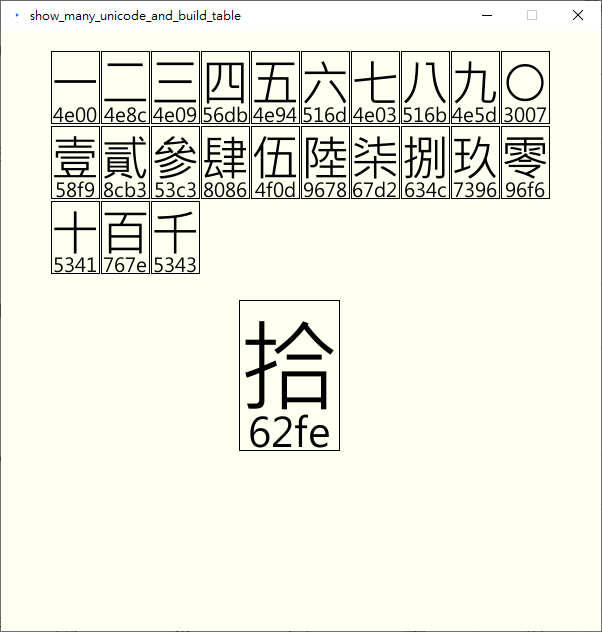

# pingping-font
嘗試製作字型前,要先完成的一些工具

## show_unicode
輸入4碼Unicode,便會秀出對應的中文字

## show_many_unicode
輸入4碼Unicode,便會秀出對應的中文字。再按SPACE或ENTER便可確認。
如果輸入錯誤, 可按BACKSPACE刪除錯誤的部分。
另外可以使用 mouseDragged()移動輸入字的框框位置

