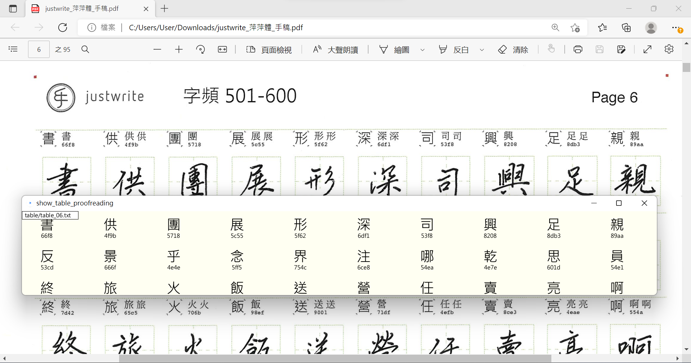

# pingping-font
嘗試製作字型前,要先完成的一些工具

## 源由
我在2018年暑假幫我太太購買 justwrite 手寫字服務, 要是在稿紙上。
在2022年完成手寫稿後, 連絡後發現 justwrite 服務已經停止。
所以我需要製作對照表, 才有辦法對照我太太的手寫稿, 進行造字的圖檔對應。
以下我先針對對照表開發程式, 並逐一輸入電腦, 完成Unicode及手寫稿位置的對照表。

## 收穫
在製作的過程中, 我有一些收穫
- 了解一些簡體字對應的繁體字
- 過程中會唸法、意思、造字原則
- 有很多很棒的Idea一直跳出來
- 開發小工具時, 從規劃、逐步測試/寫程式, 看到程式慢慢成形, 很有成就感
- 程式設計的能力變得更好了
- 邊實作、邊規劃, 越來越接近目標, 很開心
- 從頭到尾把一件事情做好, 就是成功

## show_unicode
輸入4碼Unicode,便會秀出對應的中文字

## show_unicode_create_table
這個程式, 可連續輸入 4碼 Unicode, 再逐一秀出對應的中文字, 並建立table檔
- 輸入4碼會秀出中文字, 正確時按 SPACE or ENTER 便可確認送出
- 輸入欄位 now 可用 `mouseDragged()` 移動位置
- 輸入錯誤可按 BACKSPACE 清除字碼或更多
- 關於讀檔 `myLoadTable()`: 在setup()時如果存在table.txt便會讀入
- 關於寫檔 `mySaveTable()`: 每次輸入確定時, 便會寫檔
- 已完成 table.txt 第1頁, 手動換頁即可
- 程式碼在處理部分香港字(如 Page 43 的 28468(𨑨),23350(𣍐), 會有問題。目前手動修改table.txt
- Java 無法將 \u28468 和 \u23350 正確顯示

## show_table_proofreading
校稿工具程式
- 可把 table 目錄下的 table_xx.txt 的內容秀出來,
- 利用 `mouseWheel()` 來調整視窗的大小 `surface.setSize()`, 再計算字的相對位置並畫出
- 利用 `mouseDragged()` 調整(整篇文字的)Y捲動位置 shiftY
- 利用 `keyPressed()` 的 `LEFT` 和 `RIGHT` 來切換不同檔案, 逐一秀出來
- 檔案名會秀在程式的左上角, 方便了解正在秀哪一個檔案
- 手動使用上面操作, 讓寬度與(放背景)掃描稿一致, 方便逐一校對字稿

## 目前對照表進度
- 己完成 P1-P60 含字頻5600+英數符號4頁, 對應6000字
- 已完成 P63,P64 日簡共用, 對應200字
- 已完成 P71-P88 簡化字補充
- (待輸入) P89-P98 補到字頻6600
- (待輸入) P99-P100 香港用字補充
- (缺/略過)P61,P62 日本50音(平假、片假)、符號, P65-P70和製漢字

## TODO之後可做
(8/20寫的 50-60應該都有二度校稿過, 出錯的機會變小)
TODO: 影像處理, 把 PDF 變成圖檔, 再依綠色方塊進行切割
TODO: 可以做出 Web APP, 以便在網頁中進行Unicode/中文字對照片, 也能進行字碼輸入/去查相關的文字典故
TODO: 調字高度的工具(同時秀一些句子), 調大小/調高度時, 會很有用
TODO: 可請教justfont字形設計師: 有哪些字容易寫錯/眼歪? 這些經驗很有價值
